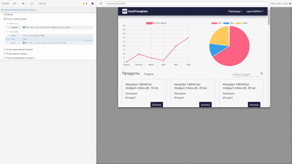

# AtomSkills
Описание нашей супер пупер навороченной информационной системы, ее предназначения, функционала.
________________
# Конфигурация Windows
.env
```bash
POSTGRESS_HOST=host.docker.internal
ENDPOINT=host.docker.internal:8080
```

# Конфигурация Linux
.env
```bash
IPV4=YOUR_IP_ADDRESS:3000
POSTGRESS_HOST=172.17.0.1
ENDPOINT=172.17.0.1:8080
```
________________


### Структура базы данных


________________
### Тестирование

Для запуска end to end тестирования необходимо запустить проект и выполнить следующую команду из дериктории frontend

 ```bash
 npm run cypress
 ```


________________
### Запуск системы

Для запуска системы необходимо наличие следующего ПО
- docker
- docker-compose
- make

Команды для сборки и запуска системы:
```bash
make build
make production
```


