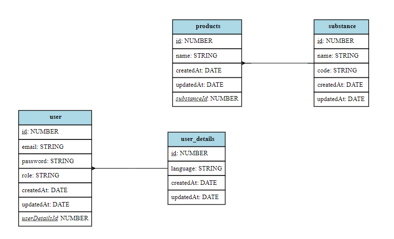

# Task10
________________
# Конфигурация Windows
.env
```bash
POSTGRESS_HOST=host.docker.internal
ENDPOINT=host.docker.internal:8080
```

# Конфигурация Linux
.env
```bash
POSTGRESS_HOST=172.17.0.1
ENDPOINT=172.17.0.1:8080
```
________________


### Структура базы данных


________________
### Запуск системы

Для запуска системы необходимо наличие следующего ПО
- docker v >= 20.10.10
- docker-compose v>=1.29.2
- make

Команды для сборки и запуска системы:
```bash
make build
make production
```


